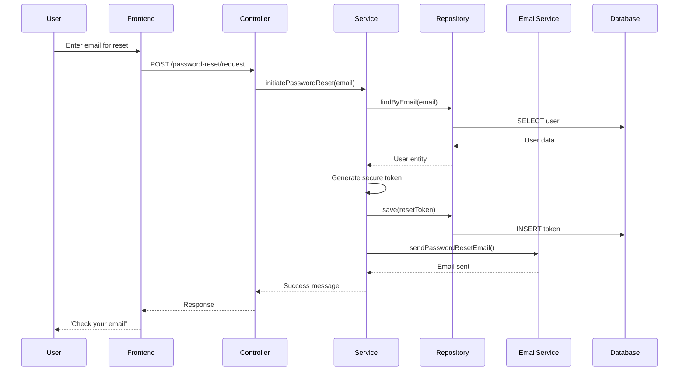

# 👨‍💻 Email System Developer Guide

## Architecture Overview

### Components Structure:
```
📧 Email System
├── 🔧 Core Services
│   ├── EmailService (Interface)
│   └── EmailServiceImpl (Implementation)
├── 🔐 Password Reset
│   ├── PasswordResetService (Interface)
│   ├── PasswordResetServiceImpl (Implementation)
│   ├── PasswordResetToken (Entity)
│   └── PasswordResetTokenRepository (Repository)
├── 🎮 Controllers
│   ├── PasswordResetController (REST API)
│   └── PasswordResetPageController (Web Pages)
└── 🎨 Templates
    ├── forgot-password.html
    └── reset-password.html
```

---

## 🏗️ Service Architecture

### EmailService Interface:
```java
public interface EmailService {
    void sendSimpleEmail(String to, String subject, String text);
    void sendHtmlEmail(String to, String subject, String htmlContent);
    void sendPasswordResetEmail(String to, String resetToken, String userFullName);
    void sendEmailVerificationEmail(String to, String verificationToken, String userFullName);
    void sendWelcomeEmail(String to, String userFullName);
    void sendPasswordChangeConfirmationEmail(String to, String userFullName);
    void sendAccountActivationEmail(String to, String userFullName);
    void sendSecurityAlertEmail(String to, String userFullName, String alertMessage);
}
```

### Key Design Patterns:
1. **Service Layer Pattern**: Business logic separation
2. **Template Method Pattern**: Email template building
3. **Repository Pattern**: Data access abstraction
4. **Scheduler Pattern**: Automated cleanup tasks

---

## 🔐 Password Reset Flow

### Step-by-Step Process:



---

## 🛠️ Implementation Details

### Token Generation:
```java
private String generateSecureToken() {
    byte[] tokenBytes = new byte[32]; // 256-bit token
    secureRandom.nextBytes(tokenBytes);
    return Base64.getUrlEncoder().withoutPadding().encodeToString(tokenBytes);
}
```

### Security Measures:
1. **Rate Limiting**: Max 3 requests per hour per user
2. **Token Expiration**: 15-minute validity
3. **One-time Use**: Tokens invalidated after use
4. **Secure Random**: Cryptographically secure token generation

### Email Template System:
```java
private String buildPasswordResetEmailTemplate(String userFullName, String resetUrl) {
    return String.format("""
        <!DOCTYPE html>
        <html dir="rtl" lang="fa">
        <!-- Beautiful HTML template with Persian support -->
        """, userFullName, resetUrl, resetUrl);
}
```

---

## 📊 Database Design

### Entity Relationships:
```sql
-- PasswordResetToken Entity
CREATE TABLE acl_password_reset_tokens (
    id BIGSERIAL PRIMARY KEY,
    token VARCHAR(255) UNIQUE NOT NULL,
    user_id BIGINT NOT NULL,
    expiry_date TIMESTAMP NOT NULL,
    created_at TIMESTAMP NOT NULL,
    used_at TIMESTAMP,
    is_used BOOLEAN NOT NULL DEFAULT FALSE,
    ip_address VARCHAR(45),
    user_agent TEXT,
    
    CONSTRAINT fk_password_reset_user 
        FOREIGN KEY (user_id) REFERENCES acl_users(id) ON DELETE CASCADE
);

-- Indexes for performance
CREATE INDEX idx_password_reset_token ON acl_password_reset_tokens(token);
CREATE INDEX idx_password_reset_user ON acl_password_reset_tokens(user_id);
CREATE INDEX idx_password_reset_expiry ON acl_password_reset_tokens(expiry_date);
```

---

## ⚙️ Configuration Management

### Environment-based Configuration:
```java
@Value("${app.password-reset.token-expiration:900000}")
private long tokenExpirationTime;

@Value("${app.password-reset.max-attempts:3}")
private int maxResetAttempts;
```

### Configuration Properties:
```properties
# Development
app.password-reset.token-expiration=900000    # 15 minutes
app.password-reset.max-attempts=3
spring.mail.host=smtp.gmail.com

# Production
app.password-reset.token-expiration=600000    # 10 minutes
app.password-reset.max-attempts=2
spring.mail.host=smtp.company.com
```

---

## 🔍 Error Handling

### Custom Exception Handling:
```java
@ControllerAdvice
public class PasswordResetExceptionHandler {
    
    @ExceptionHandler(InvalidTokenException.class)
    public ResponseEntity<?> handleInvalidToken(InvalidTokenException e) {
        Map<String, Object> response = new HashMap<>();
        response.put("success", false);
        response.put("message", "توکن نامعتبر یا منقضی شده");
        return ResponseEntity.badRequest().body(response);
    }
    
    @ExceptionHandler(RateLimitExceededException.class)
    public ResponseEntity<?> handleRateLimit(RateLimitExceededException e) {
        Map<String, Object> response = new HashMap<>();
        response.put("success", false);
        response.put("message", "تعداد درخواست‌ها بیش از حد مجاز");
        return ResponseEntity.status(429).body(response);
    }
}
```

---

## 📝 Logging Strategy

### Structured Logging:
```java
@Slf4j
public class PasswordResetServiceImpl {
    
    public String initiatePasswordReset(String email) {
        log.info("Password reset requested for email: {}", email);
        
        try {
            // Business logic
            log.info("Reset email sent successfully to: {}", email);
            return "Success message";
        } catch (Exception e) {
            log.error("Failed to send reset email to {}: {}", email, e.getMessage(), e);
            throw new EmailSendException("Failed to send reset email", e);
        }
    }
}
```

### Log Levels:
- **INFO**: Successful operations
- **WARN**: Rate limiting, invalid attempts
- **ERROR**: System failures, email send failures
- **DEBUG**: Detailed flow information

---

## 🧪 Testing Strategy

### Unit Tests:
```java
@ExtendWith(MockitoExtension.class)
class PasswordResetServiceTest {
    
    @Mock
    private UserRepository userRepository;
    
    @Mock
    private PasswordResetTokenRepository tokenRepository;
    
    @Mock
    private EmailService emailService;
    
    @InjectMocks
    private PasswordResetServiceImpl passwordResetService;
    
    @Test
    void testInitiatePasswordReset_Success() {
        // Given
        String email = "test@example.com";
        User user = new User();
        user.setEmail(email);
        user.setStatus(User.UserStatus.ACTIVE);
        
        when(userRepository.findByEmail(email)).thenReturn(Optional.of(user));
        when(tokenRepository.countRecentTokensByUser(any(), any())).thenReturn(0L);
        
        // When
        String result = passwordResetService.initiatePasswordReset(email);
        
        // Then
        assertThat(result).contains("ارسال شد");
        verify(emailService).sendPasswordResetEmail(eq(email), any(), any());
    }
}
```

### Integration Tests:
```java
@SpringBootTest
@AutoConfigureTestDatabase(replace = AutoConfigureTestDatabase.Replace.NONE)
class PasswordResetIntegrationTest {
    
    @Autowired
    private TestRestTemplate restTemplate;
    
    @Test
    void testPasswordResetFlow() {
        // Test complete flow from request to reset
    }
}
```

---

## 🚀 Performance Optimization

### Database Optimization:
1. **Indexes** on frequently queried columns
2. **Cleanup Scheduled Task** for expired tokens
3. **Connection Pooling** for email service
4. **Async Processing** for email sending

### Caching Strategy:
```java
@Cacheable(value = "resetTokens", key = "#token")
public boolean validateResetToken(String token) {
    return tokenRepository.existsByTokenAndIsValidAndNotExpired(token, LocalDateTime.now());
}
```

---

## 🔧 Extending the System

### Adding New Email Types:
1. Add method to `EmailService` interface
2. Implement in `EmailServiceImpl`
3. Create HTML template
4. Add configuration if needed

### Custom Email Providers:
```java
@Component
@ConditionalOnProperty(name = "mail.provider", havingValue = "sendgrid")
public class SendGridEmailService implements EmailService {
    // SendGrid implementation
}
```

### Multi-language Support:
```java
@Service
public class EmailTemplateService {
    
    public String getTemplate(String templateName, Locale locale) {
        return messageSource.getMessage(templateName, null, locale);
    }
}
```

---

## 📈 Monitoring & Metrics

### Custom Metrics:
```java
@Component
public class PasswordResetMetrics {
    
    private final Counter resetRequests = Counter.builder("password_reset_requests")
            .description("Number of password reset requests")
            .register(Metrics.globalRegistry);
    
    private final Timer emailSendTime = Timer.builder("email_send_duration")
            .description("Time taken to send emails")
            .register(Metrics.globalRegistry);
}
```

### Health Checks:
```java
@Component
public class EmailServiceHealthIndicator implements HealthIndicator {
    
    @Override
    public Health health() {
        try {
            // Test email connection
            return Health.up()
                    .withDetail("provider", "Gmail SMTP")
                    .withDetail("status", "Connected")
                    .build();
        } catch (Exception e) {
            return Health.down()
                    .withDetail("error", e.getMessage())
                    .build();
        }
    }
}
```

---

## 🔄 Deployment Considerations

### Environment Variables:
```yaml
# docker-compose.yml
environment:
  - MAIL_USERNAME=${MAIL_USERNAME}
  - MAIL_PASSWORD=${MAIL_PASSWORD}
  - BASE_URL=https://iran-bazaar.com
  - FRONTEND_URL=https://iran-bazaar.com
```

### Production Settings:
```properties
# Shorter token expiration in production
app.password-reset.token-expiration=600000

# Stricter rate limiting
app.password-reset.max-attempts=2

# SSL/TLS configuration
spring.mail.properties.mail.smtp.ssl.enable=true
```

---

## 🆘 Common Issues & Solutions

### Issue 1: Emails not being sent
```java
// Solution: Check SMTP configuration
@EventListener
public void handleEmailFailure(EmailFailureEvent event) {
    log.error("Email send failed: {}", event.getError());
    // Implement retry logic or fallback provider
}
```

### Issue 2: Token cleanup not working
```java
// Solution: Verify scheduling is enabled
@EnableScheduling // Make sure this is present
@SpringBootApplication
public class Application {
    // ...
}
```

### Issue 3: Rate limiting too strict
```java
// Solution: Adjust configuration
app.password-reset.max-attempts=5
app.password-reset.window-hours=2
```

---

**Last Updated**: October 2025  
**Version**: 1.0.0
